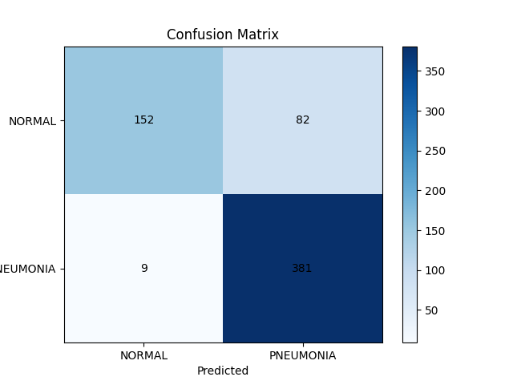
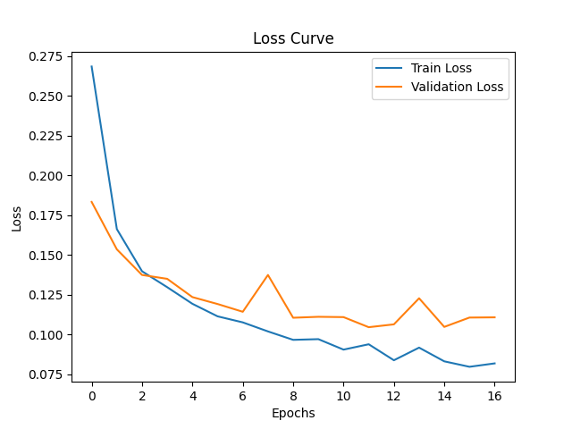
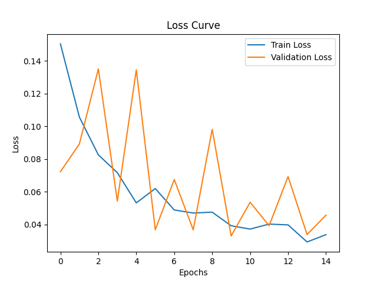
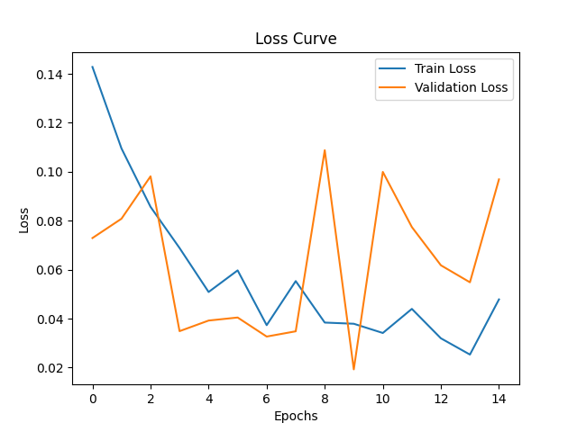

# Pneumonia Detection from Chest X-rays — ResNet18

Fine-tuned ResNet18 to detect pneumonia from chest X-rays. The main finding: deeper fine-tuning gave better validation numbers but unstable training curves — more model capacity isn't always better when training distribution is biased.

## Results

- **Test accuracy:** 85.4%
- **Test precision:** 82.3%
- **Test recall:** 97.7%

### Confusion matrix


|  | Pred Normal | Pred Pneumonia |
|---|---|---|
| **True Normal** | 152 | 82 |
| **True Pneumonia** | 9 | 381 |

The model achieves 97.7% recall on Pneumonia (381/390 correct) but only 65% recall on Normal (152/234 correct). 82 healthy patients were wrongly flagged as having pneumonia — likely a consequence of the 1:2.89 class imbalance in training data combined with distribution shift between train and test sets.

## Dataset

- Source: https://www.kaggle.com/datasets/paultimothymooney/chest-xray-pneumonia
- Train: 5,216 images (Normal: 1,341 | Pneumonia: 3,875)
- Test: 624 images (Normal: 234 | Pneumonia: 390)
- Train class balance: Normal=25.7%, Pneumonia=74.3%
- Test class balance: Normal=37.5%, Pneumonia=62.5% (different distribution from train)

## Method

- **Architecture:** ResNet18 pretrained on ImageNet; replaced final FC with 2-class head
- **Loss:** CrossEntropyLoss with class weights `[2.0, 1.0]` favoring the minority Normal class
- **Optimizer:** Adam, lr=1e-3
- **Epochs:** up to 30 (early stopped via patience=5, min_delta=0.001)
- **Batch size:** 32
- **Input:** 224×224, ImageNet normalization
- **Data augmentation** (used in fine-tuned ablation configs only): random horizontal flip, random affine (rotation ±10°, translate ±5%, scale 0.95–1.05), color jitter (brightness/contrast ±20%)

## Ablation: fine-tuning strategy

I tested various configurations and found these 3 top contenders, comparing them on validation behavior and training stability:

| Configuration | LR | Best Val Loss | Val Precision | Val Recall |
|---|---|---|---|---|
| Replaced classification layer + class weights  | 0.001 | 0.105 | 0.983 | 0.959 |
| Replaced classification layer + Layer4 unfrozen + aug + class weights | 0.001 | 0.031 | 0.993 | 0.997 |
| Replaced classification layer + Layer3+Layer4 unfrozen + aug + class weights | 0.0001 | 0.019 | 0.999 | 0.990 |

Full experiment log: `results/hyperparameters_tuning_results.csv`

Lower val_loss looked tempting in the fine-tuned configs — but training curves told a different story.

### Replaced classification layer + class weights (winner) 
ResNet18's original 1000-class FC layer is replaced with a new 2-class FC head. All other pretrained layers stay frozen — only the new FC trains.



Smooth convergence. Train and val loss track each other with a small, stable gap throughout training. No overfitting signs.

### Replaced classification layer + Layer4 unfrozen + aug + class weights
Same FC replacement as above, but ResNet18's last block (layer4) is also unfrozen, with data augmentation enabled during training.



Reached lower absolute val_loss but with frequent spikes (val_loss jumping from ~0.04 to ~0.13). The optimizer is finding good minima but not staying there reliably.

### Replaced classification layer + Layer3+Layer4 unfrozen + aug + class weights
Two ResNet18 blocks unfrozen alongside the new FC — more trainable parameters than the previous config.



Best val_loss numerically but the bounciest curve of all — val_loss spikes reach 0.13–0.19. More trainable parameters = more capacity to swing between minima.

### Why I picked the winner

Looking at both the table and the training curves together:

- The **Layer4** and **Layer3+Layer4** unfrozen configs have lower val loss, but their curves show frequent val_loss spikes — the model finds good minima but doesn't stay there reliably.
- The **winner config** has slightly higher val loss, but the smoothest training curve. Train and val track each other closely throughout, with no signs of overfitting or instability.

A model that finds a low loss erratically isn't more useful than one that finds a slightly higher loss reliably. The numbers in the table show that all three configurations achieve strong val metrics (>98% precision) — so the deciding factor became **which model trained stably**.

The winner won on stability while staying competitive on metrics.

**Test set evaluation on the winner**: 82.3% precision, 97.7% recall, 85.4% accuracy.

## Error analysis

The 82 false positives (Normal patients flagged as Pneumonia) are the model's main weakness. With ImageNet-pretrained features and a heavily pneumonia-biased training set, the model defaults toward predicting Pneumonia when uncertain. Class weights `[2.0, 1.0]` reduced this from 90+ to 82 errors but couldn't eliminate it. Test set distribution (1:1.67) differs from train (1:2.89), suggesting the train/test sets may also come from different imaging sources.

## Limitations

- **Small test set (624 images) from the same data source as train.** Real-world generalization to other hospitals' imaging equipment is untested.
- **No comparison against a non-deep-learning baseline** (e.g., logistic regression on simple features). Would have been useful for sanity checking.
- **Single train/test split, no cross-validation.** Reported numbers have unknown variance — running multiple seeds would give confidence intervals.
- **No AUC / ROC analysis yet** — only point estimates at the default 0.5 threshold.

## What I learned

- **Validation can lie when val is split from training data.** Val accuracy reached 99% on aggressive fine-tuning configs, but training curves showed the model was memorizing rather than generalizing.
- **Train loss approaching zero is a red flag**, even when val metrics look great. Fine-tuning Layer4 alone reached train_loss=0 by epoch 6 — a sign of memorization.
- **Simpler beats fancier when distribution shift dominates.** Class weights alone (no augmentation, no fine-tuning) showed the most stable training behavior across all configurations.
- **Test set discipline matters.** In a stricter workflow, test should be touched once after all model decisions are final.

## What I'd try next

- Grad-CAM to visualize where the model is looking
- Test-time augmentation (TTA) for more robust predictions
- Threshold tuning to reduce false positives without retraining
- DenseNet121 / EfficientNet for architecture comparison
- Reweight test distribution to match expected real-world ratio
- Generate sample predictions grid (correct vs wrong) for visual error analysis
- Add AUC / ROC analysis

## Reproduce

```bash
git clone https://github.com/shivangi2002/pneumonia-resnet18
cd pneumonia-resnet18
python -m venv .venv
.venv\Scripts\activate  # Windows
pip install -r requirements.txt

# Download dataset and place under data/train/{NORMAL,PNEUMONIA} and data/test/{NORMAL,PNEUMONIA}

# Train winning config
python -c "from main import run_model; run_model(lr=0.001, images_per_batch=32, num_epochs=30, augment=False, class_weights=[2.0, 1.0], fine_tune_layers=0)"

# Evaluate on test set
python -c "from test_eval import run_test_eval; run_test_eval('checkpoints/lr0.001_bs32_epochs30_w2.pth')"
```

## Files

- `main.py` — training entry point with `run_model()`
- `test_eval.py` — test set evaluation with confusion matrix
- `src/dataset.py` — XRayDataset + TransformedSubset wrapper
- `src/model.py` — ResNet18 with configurable `fine_tune_layers` (0, 1, 2)
- `src/train.py` — training loop with early stopping
- `src/eval.py` — validation metrics (loss, accuracy, precision, recall, confusion matrix)
- `src/visualize.py` — loss curve + confusion matrix plotting
- `src/logger.py` — experiment logging to CSV
- `results/hyperparameters_tuning_results.csv` — full experiment log
- `plots/` — loss curves and confusion matrices